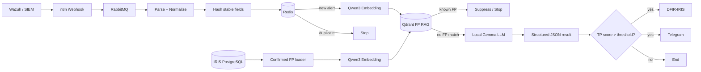

# AI-Assisted SOC Alert Triage with n8n, RAG, and a Local LLM

A portfolio/reference implementation of an automated SOC triage pipeline that combines queue-based alert ingestion, duplicate suppression, retrieval of historical analyst false-positive decisions, local LLM analysis, and incident escalation.

> **Safety note:** This repository contains a sanitized n8n export. It intentionally contains no production API tokens, customer identifiers, internal IP addresses, Telegram chat IDs, or reusable n8n credential IDs. Do not commit production secrets.

## What the system does

The project contains three logical workflows in one n8n canvas:

1. **False-positive knowledge ingestion** — periodically reads analyst-confirmed false positives from DFIR-IRIS/PostgreSQL, generates Qwen3 embeddings, and stores vectors plus analyst context in Qdrant.
2. **Alert ingestion** — accepts alerts through an n8n webhook and places them on RabbitMQ so producers are decoupled from downstream AI processing.
3. **AI alert triage** — consumes one alert at a time, normalizes it, hashes stable fields, checks Redis for duplicates, searches Qdrant for known false-positive patterns, and sends unmatched events to a local Gemma model. Events with a configured high TP score are sent to DFIR-IRIS and Telegram.

## Architecture



## Why these components

| Component | Role |
|---|---|
| n8n | Orchestration and integration layer |
| RabbitMQ | Durable asynchronous handoff between alert ingestion and processing |
| Redis | Short-lived duplicate detection using a normalized alert hash |
| Qwen3-Embedding-4B | Converts alert text into vectors for similarity search |
| Qdrant | Stores historical false-positive vectors and analyst context |
| Gemma | Local LLM used for structured alert triage and response guidance |
| DFIR-IRIS | Analyst case/alert management and source of confirmed FP decisions |
| Telegram | High-confidence notification channel |

## Processing logic

### 1. Learning from analyst-confirmed false positives

A scheduled branch queries IRIS for alerts whose resolution is `False Positive`. A workflow-static list prevents the same alert ID from being re-ingested during normal operation. Each new record is embedded and written to the `fp_alerts_demo` Qdrant collection with the alert ID, title, analyst justification, log context, and `status=false_positive` metadata.

This is **retrieval-augmented decision support**, not model fine-tuning: analyst decisions remain external, auditable knowledge that can be updated without retraining the LLM.

### 2. Queue-based ingestion

The public webhook accepts an alert and immediately publishes the JSON message to `isv_alert_processing_queue`. RabbitMQ isolates ingestion from model latency and temporary downstream failures. The consumer is configured to acknowledge a message after the n8n execution finishes successfully.

### 3. Duplicate suppression

Before AI processing, the workflow deep-copies the alert body and removes volatile fields such as timestamps, unique alert IDs, and `full_log`. The remaining structured event is hashed and used in a tenant-aware Redis key:

```text
soc:alerts:<tenant>:<alert_hash>
```

The current workflow stores the key with a TTL of **40,000 seconds (~11.1 hours)**. Treat this as a tuning parameter: overly broad normalization can suppress distinct events, while overly narrow normalization reduces deduplication.

### 4. RAG false-positive lookup

For a new alert, Qwen3 generates an embedding from the alert description and log context. Qdrant searches the false-positive collection using `limit=5` and a current similarity threshold of `0.85`. If any returned payload is marked `false_positive`, the workflow stops before the LLM stage.

The `0.85` threshold is an implementation setting, **not a universal security threshold**. Validate it against labeled alerts and measure false suppression before production use.

### 5. Local LLM triage

Alerts that do not match the FP knowledge base are sent to `RedHatAI/gemma-4-26B-A4B-it-NVFP4`. The prompt asks for strict JSON containing a short analysis, extracted IoCs, TP/FP scores totaling 100, and a response playbook. The workflow parses the model response as JSON.

The current automation gate is `true_positive_score > 90`. When that condition is met, the workflow creates an alert in DFIR-IRIS and sends a Telegram notification. This score is produced by the LLM and should be treated as an application heuristic rather than a calibrated probability unless separately calibrated and validated.

## Data flow

```text
Alert producer
  -> Webhook
  -> RabbitMQ
  -> Parse / normalize
  -> Redis duplicate check
  -> Qwen3 embedding
  -> Qdrant FP similarity search
     -> known FP: stop
     -> otherwise: Gemma triage
  -> parse structured response
  -> TP-score gate
     -> DFIR-IRIS + Telegram
```

## Repository layout

```text
.
├── README.md
├── LICENSE
├── .gitignore
├── .env.example
├── workflows/
│   └── autosoc-sanitized.json
├── docs/
│   ├── architecture.md
│   ├── rag-design.md
│   ├── security.md
│   └── deployment.md
├── prompts/
│   └── triage-prompt.md
└── examples/
    ├── sample-wazuh-alert.json
    └── sample-ai-response.json
```

## Quick start

1. Deploy or provide n8n, RabbitMQ, Redis, Qdrant, an OpenAI-compatible embedding endpoint, a Gemma-compatible chat endpoint, and DFIR-IRIS as required.
2. Import `workflows/autosoc-sanitized.json` into n8n.
3. Create n8n credentials for RabbitMQ, Redis, PostgreSQL/IRIS, Telegram, and the local LLM endpoint.
4. Replace all `REPLACE_*`, `example.local`, `DEMO_CUSTOMER_ID`, and demo collection values.
5. Create the Qdrant collection with a vector size/distance compatible with the embedding model you deploy.
6. Test with synthetic alerts before enabling production ingestion.
7. Validate RAG similarity and escalation thresholds on labeled data before allowing automated suppression or case creation.

See [Deployment](docs/deployment.md) and [Security](docs/security.md) before using the workflow outside a lab.

## Design principles

- **Queue first:** alert producers should not wait for an LLM.
- **Deduplicate before inference:** avoid spending GPU/model time on repeated events.
- **Retrieve before reason:** reuse analyst-confirmed historical knowledge before invoking the LLM.
- **Local inference:** keep sensitive telemetry within controlled infrastructure where required.
- **Structured output:** machine-readable JSON makes downstream automation deterministic.
- **Human-verifiable decisions:** retain source logs, retrieved context, and analyst outcomes so automated decisions can be reviewed.

## Current limitations

The workflow is a working engineering prototype, not a complete autonomous SOC. The LLM score is not inherently calibrated; RAG similarity can produce false matches; the current FP branch suppresses an alert when a matching payload is found; static workflow data for processed FP IDs can grow over time; and VirusTotal enrichment is present in the canvas but requires further integration into the final decision path. Production deployments should add evaluation datasets, observability, dead-letter/retry handling, schema validation, access controls, secret management, and explicit human-review policies.

## License

MIT. See `LICENSE`.
